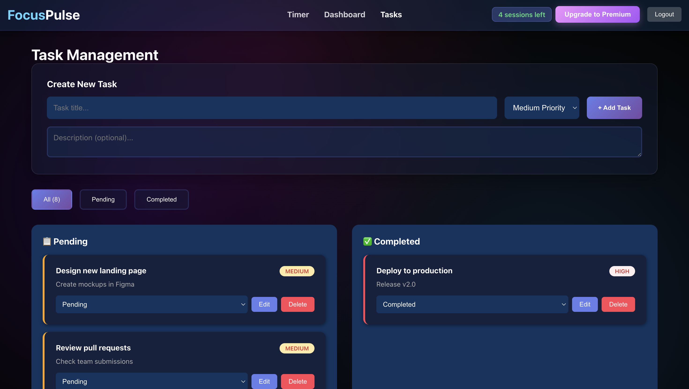
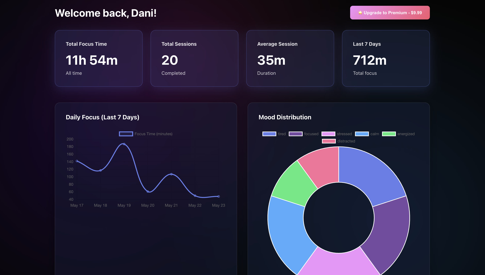
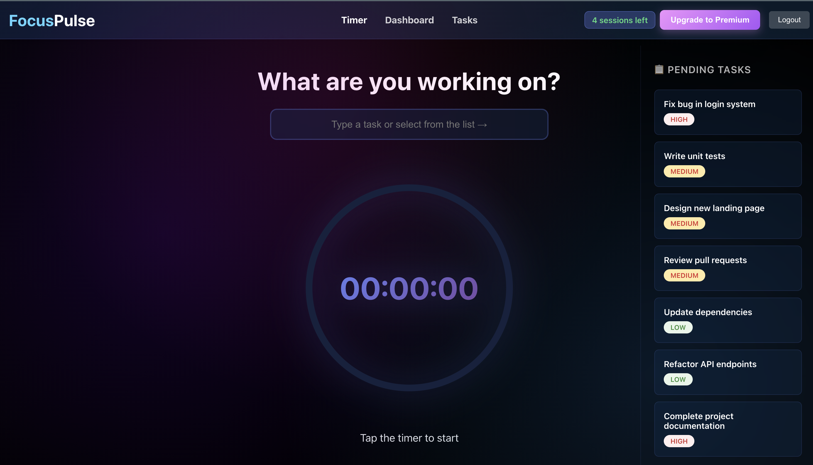

# FocusPulse

FocusPulse is a full-stack productivity app for tracking focus sessions, tasks, and progress. The repository is organized as a small MERN-style workspace with a React frontend and an Express/MongoDB backend.

## Overview

- React app for authentication, timer, dashboard, tasks, and payment success flow
- Express API for auth, sessions, tasks, and payment routes
- MongoDB persistence through Mongoose models
- CRA frontend with reusable pages and components

## Screenshots

### Tasks Page



### Dashboard



### Timer



## Project Structure

```
FocusPulse/
├── backend/
│   ├── server.js
│   ├── routes/
│   ├── models/
│   └── middleware/
├── frontend/
│   ├── public/
│   └── src/
├── screenshots/
│   ├── Tasks.png
│   ├── dashboard.png
│   └── timer.png
├── package.json
└── README.md
```

## Requirements

- Node.js 18+ recommended
- MongoDB connection string for the backend
- npm

## Setup

1. Install dependencies for the backend and frontend.

```bash
npm run install-all
```

2. Configure environment variables.

- `backend/.env` should define `MONGODB_URI`, `JWT_SECRET`, `STRIPE_SECRET_KEY`, and `PORT` if needed.
- `frontend/.env` should define the frontend variables used by the app if you add any.

3. Start both apps from the repository root.

```bash
npm run dev
```

The frontend runs on the CRA default port and the backend listens on port `5000` unless you change it.

## Scripts

- `npm run install-all` installs both app dependencies
- `npm run dev` runs the backend and frontend together
- `npm run server` starts the backend only
- `npm run client` starts the frontend only
- `npm run build` builds the frontend for production


